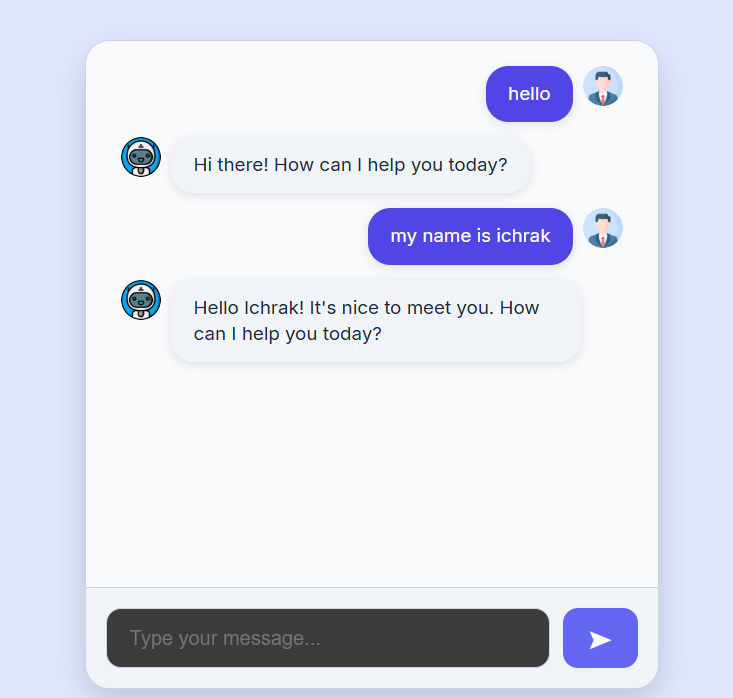

# 🧠 Chatbot Project

**React + Vite Frontend • Flask Backend • Gemini API**

This project is a simple full-stack chatbot application.\
It includes:

-   A **React (Vite)** frontend\
-   A **Flask** backend\
-   Integration with **Google Gemini** (via `google-generativeai`)

------------------------------------------------------------------------


## 🚀 Features

### **Frontend (React + Vite)**

-   Clean and modern chat UI\
-   User and bot avatars\
-   Auto-scrolling messages\

### **Backend (Flask)**

-   REST API endpoint `/chat`\
-   Uses Gemini model: **gemini-2.5-flash-lite**\
-   Returns generated text to the frontend

------------------------------------------------------------------------

## 🔧 Technology Stack

### **Frontend**

-   React (Vite)
-   Axios
-   CSS

### **Backend**

-   Python 3
-   Flask
-   google-generativeai

------------------------------------------------------------------------

## 📦 Installation

### 1️⃣ Clone

``` bash
git clone <your-repo-url>
cd CHATBOT_PROJECT
```

------------------------------------------------------------------------

## 🖥️ Backend Setup (Flask)

``` bash
cd server
python -m venv venv
source venv/bin/activate   # Mac/Linux
venv\Scripts\activate    # Windows
pip install -r requirements.txt
```

### Add `.env`:

    GOOGLE_API_KEY=YOUR_API_KEY

### Run:

``` bash
python app.py
```

Runs at: `http://127.0.0.1:5000`

------------------------------------------------------------------------

## 🌐 Frontend Setup (React)

``` bash
cd client/chatbot_project
npm install
npm run dev
```

Runs at: `http://localhost:5173`

------------------------------------------------------------------------


## 📜 License

Free to use for learning.
